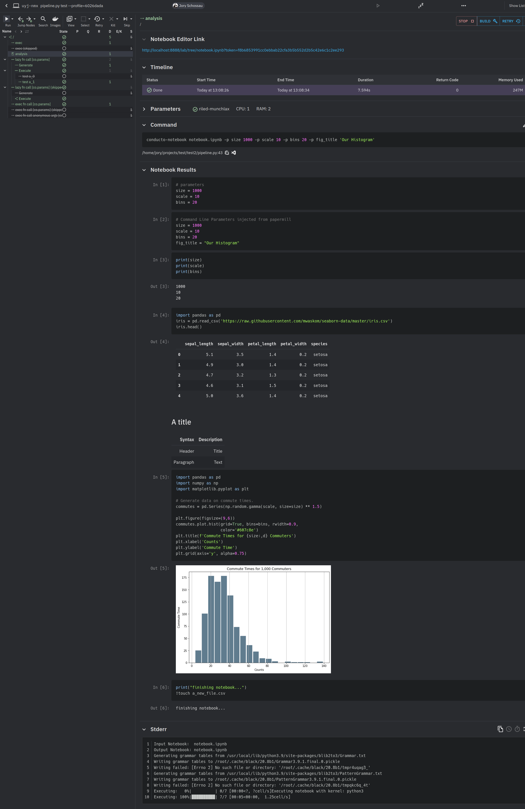

# Conducto's Notebook Node Feature

This is a portfolio showcase for one of my projects for the data science pipeline company [Conducto](https://www.conducto.com/).
I added the ability to easily productionize Jupyter Notebooks into the Conducto scriptable pipeline.
I also added easy live notebook development and debugging within that pipeline with a single click of a button, which allows rapid prototyping of at-scale workflows.

### Technology I Used

* Python (`conducto-notebook` tool, and general server-side code)
* AWS (server-side administration and database inspection)
* Rust (for cloud worker client code)
* React (for web UI)
* Docker (for exec environment automation)
* MongoDB (node scheduling from Github integration callbacks)

### Conducto Features

* writing python that creates a work tree scaling to thousands of jobs on remote cloud compute
* each node/worker can be an arbitrary command running in an arbitrary docker environment

### Notebook Features (what I created)

* wraps Windmill
* parameterize your notebook by assigning default values to variables and putting `# parameters` at the top of the cell
* test locally with `conducto-notebook <notebook_name> -p <name> <value> ...`
* run in local or remote pipeline with new pipeline node type `co.Notebook('notebook_path.ipynb',<name>=<value>,...)`
* debug and update a generated `co.Notebook` node live - spins up a Jupyter Notebook server for you and gives you a link
* see your notebook run live even if it's remote, and see the output in realtime as your notebook updates, just like in Jupyter Notebook

